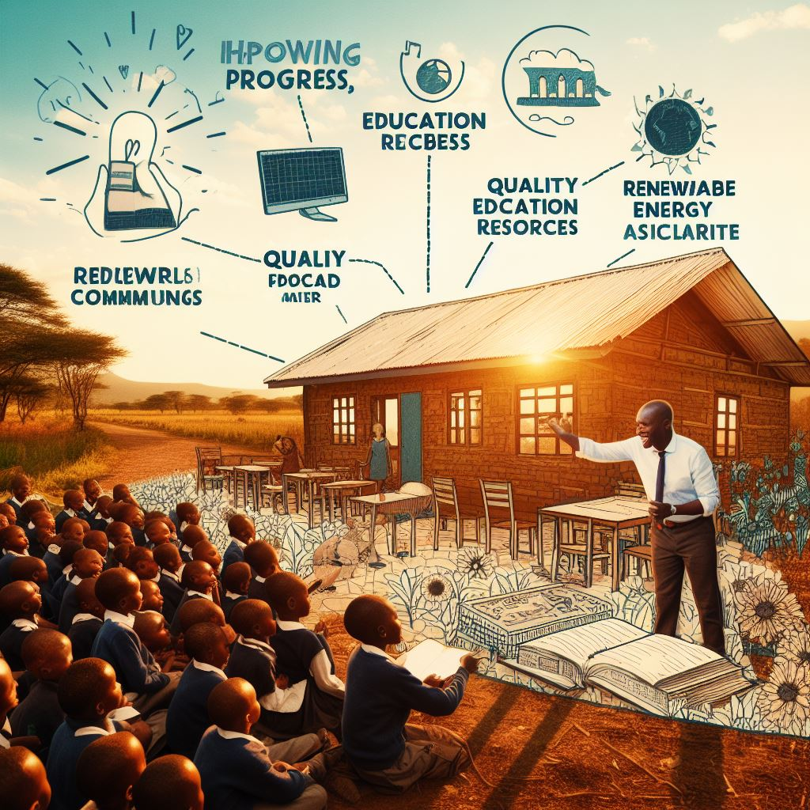
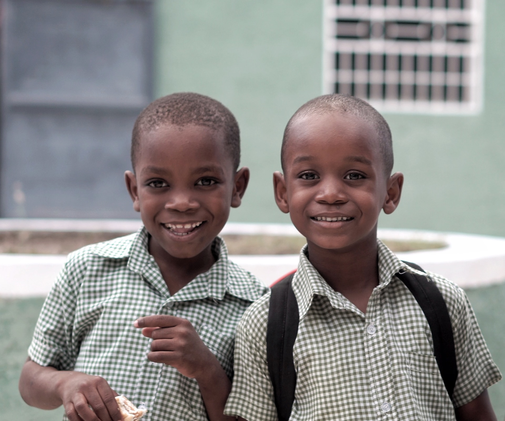

# Sharks Vision Board

## Introduction
Insert a meme/image that represents your team's motivation and inspiration for participating in Game of Learners Season 4.

## Goals
- Insert a meme/image that represents your team's primary goal for Game of Learners
- Insert a meme/image that represents your team's secondary goal for Game of Learners
- Insert a meme/image that represents your team's stretch goal for Game of Learners
Skills
- Insert a meme/image that represents the skills you want to learn and develop during Game of Learners
- Insert a meme/image that represents the skills you want to improve during Game of Learners

## Collaboration
- Insert a meme/image that represents your team's communication and collaboration strategy for Game of Learners
- Insert a meme/image that represents your team's approach to giving and receiving feedback during Game of Learners

## Success
- Insert a meme/image that represents what success in Game of Learners looks like for your team
- Insert a meme/image that represents the rewards and benefits of achieving your team's goals in Game of Learners

## Conclusion
### Working towards a hhappy learning community

Our vision is to make a better community with rural students learning and accessing resources with no limits.

Feel free to modify and customize this template as needed to fit your specific team's goals and objectives! But this is just a guide on what you can inlude in the board